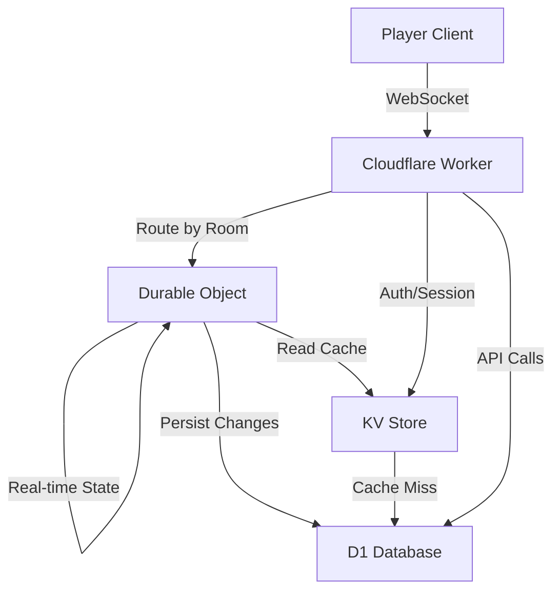

# Cloudflare MUD Architecture

## Overview

This document outlines our architecture using Cloudflare's ecosystem: D1 (database), KV (cache), and Durable Objects (real-time state).

**Important**: See `/docs/code/database-design-guide.md` for detailed D1 scaling patterns and enforcement rules.

## Why This Works for MUDs

1. **10GB is plenty**: A text-based MUD with thousands of players uses far less than 10GB
2. **Real-time via Durable Objects**: Perfect for room state and player interactions
3. **Global edge network**: Low latency for players worldwide
4. **Cost-effective**: Pay only for what you use

## Architecture Components

### 1. D1 - Persistent Game Data
**Use for**: Long-term storage of all game data
- Player accounts and characters
- World data (rooms, NPCs, items)
- Character inventory and stats
- Quest progress
- Audit logs

```sql
-- Simplified schema for SQLite/D1
CREATE TABLE players (
  id TEXT PRIMARY KEY,
  username TEXT NOT NULL UNIQUE,
  email TEXT NOT NULL UNIQUE,
  created_at INTEGER NOT NULL DEFAULT (unixepoch()),
  last_login INTEGER
);

CREATE TABLE characters (
  id TEXT PRIMARY KEY,
  player_id TEXT NOT NULL,
  name TEXT NOT NULL UNIQUE,
  -- Store complex data as JSON
  stats TEXT NOT NULL DEFAULT '{"power":10,"speed":10,"spirit":10,"recovery":10}',
  location TEXT NOT NULL DEFAULT 'spawn_room',
  created_at INTEGER NOT NULL DEFAULT (unixepoch()),
  FOREIGN KEY (player_id) REFERENCES players(id)
);

CREATE TABLE rooms (
  id TEXT PRIMARY KEY,
  area_id TEXT NOT NULL,
  data TEXT NOT NULL, -- JSON with title, description, exits, etc.
  created_at INTEGER NOT NULL DEFAULT (unixepoch())
);
```

### 2. KV - Fast Access Cache
**Use for**: Frequently accessed, rarely changed data
- Room descriptions and exits (cache from D1)
- Item definitions
- NPC templates
- Game configuration
- Session tokens
- Player online status

```typescript
// KV usage patterns
interface KVNamespaces {
  ROOM_CACHE: KVNamespace;      // room:{id} -> room data
  ITEM_DEFS: KVNamespace;       // item:{id} -> item definition
  SESSIONS: KVNamespace;        // session:{token} -> player_id
  ONLINE_PLAYERS: KVNamespace;  // online:{player_id} -> server info
  CONFIG: KVNamespace;          // config:{key} -> value
}

// Cache room data with 1 hour TTL
await env.ROOM_CACHE.put(
  `room:${roomId}`,
  JSON.stringify(roomData),
  { expirationTtl: 3600 }
);
```

### 3. Durable Objects - Real-time Game State
**Use for**: Active game rooms and real-time coordination
- Active room state (who's in the room)
- Combat state
- Real-time chat
- Player WebSocket connections
- Temporary buffs/debuffs

```typescript
export class GameRoom implements DurableObject {
  private connections = new Map<string, WebSocket>();
  private players = new Map<string, PlayerState>();
  private roomId: string;
  
  constructor(private state: DurableObjectState, private env: Env) {
    this.roomId = state.id.toString();
  }

  async fetch(request: Request): Promise<Response> {
    if (request.headers.get("Upgrade") === "websocket") {
      const pair = new WebSocketPair();
      await this.handleWebSocket(pair[1], request);
      return new Response(null, { status: 101, webSocket: pair[0] });
    }
    
    // Handle HTTP requests for room state
    return this.handleHttp(request);
  }

  async handleWebSocket(ws: WebSocket, request: Request) {
    const playerId = new URL(request.url).searchParams.get("playerId");
    if (!playerId) {
      ws.close(1008, "Missing playerId");
      return;
    }

    // Accept the connection
    this.state.acceptWebSocket(ws);
    this.connections.set(playerId, ws);

    // Load player data from D1
    const player = await this.loadPlayer(playerId);
    this.players.set(playerId, player);

    // Notify others in room
    this.broadcast({
      type: "player_entered",
      playerId,
      playerName: player.name,
    }, playerId);
  }

  webSocketMessage(ws: WebSocket, message: string) {
    const playerId = this.getPlayerId(ws);
    const data = JSON.parse(message);

    switch (data.type) {
      case "say":
        this.handleSay(playerId, data.message);
        break;
      case "move":
        this.handleMove(playerId, data.direction);
        break;
      case "action":
        this.handleAction(playerId, data.action, data.target);
        break;
    }
  }

  webSocketClose(ws: WebSocket) {
    const playerId = this.getPlayerId(ws);
    this.connections.delete(playerId);
    this.players.delete(playerId);
    
    this.broadcast({
      type: "player_left",
      playerId,
    });
  }
}
```

## Data Flow Architecture



## Key Design Patterns

### 1. Room-Based Sharding
Each room is a Durable Object, providing natural sharding:
```typescript
// Get or create room Durable Object
const roomId = env.GAME_ROOMS.idFromName(`room:${roomName}`);
const roomStub = env.GAME_ROOMS.get(roomId);
```

### 2. Write-Through Cache
Updates go to D1, then invalidate KV:
```typescript
async function updateRoom(roomId: string, updates: Partial<Room>) {
  // Update D1
  await env.DB.prepare(
    "UPDATE rooms SET data = ? WHERE id = ?"
  ).bind(JSON.stringify(updates), roomId).run();
  
  // Invalidate KV cache
  await env.ROOM_CACHE.delete(`room:${roomId}`);
}
```

### 3. Session Management
Use KV for fast session validation:
```typescript
// Store session in KV with 24h expiry
await env.SESSIONS.put(
  `session:${token}`,
  playerId,
  { expirationTtl: 86400 }
);
```

### 4. Hybrid Storage for Characters
Active character state in Durable Object, persistent in D1:
```typescript
class CharacterState {
  // Volatile state (in DO memory)
  buffs: Map<string, Buff> = new Map();
  combatState?: CombatState;
  
  // Persistent state (synced to D1)
  async save(env: Env, characterId: string) {
    await env.DB.prepare(
      "UPDATE characters SET stats = ?, location = ? WHERE id = ?"
    ).bind(
      JSON.stringify(this.stats),
      this.location,
      characterId
    ).run();
  }
}
```

## Migration Strategy

### 1. Schema Conversion
Convert PostgreSQL schema to SQLite:
- UUID → TEXT (use crypto.randomUUID())
- JSONB → TEXT (JSON.stringify/parse)
- Arrays → JSON arrays in TEXT
- Timestamps → INTEGER (Unix timestamps)

### 2. Drizzle Configuration
```typescript
// drizzle.config.ts
export default defineConfig({
  schema: "./src/database/schema.ts",
  out: "./drizzle",
  dialect: "sqlite",
  driver: "d1",
  dbCredentials: {
    wranglerConfigPath: "wrangler.toml",
    dbName: "mud-db",
  },
});
```

### 3. Repository Updates
Update repositories to use D1 bindings:
```typescript
export class PlayerRepository {
  constructor(private db: D1Database) {}
  
  async findById(id: string): Promise<Player | null> {
    const result = await this.db
      .prepare("SELECT * FROM players WHERE id = ?")
      .bind(id)
      .first();
    
    return result ? this.mapToPlayer(result) : null;
  }
}
```

## Performance Optimizations

### 1. Batch Reads
Use D1's batch API for multiple queries:
```typescript
const batch = await env.DB.batch([
  env.DB.prepare("SELECT * FROM players WHERE id = ?").bind(playerId),
  env.DB.prepare("SELECT * FROM characters WHERE player_id = ?").bind(playerId),
]);
```

### 2. Smart KV Caching
Cache computed/aggregated data:
```typescript
// Cache player's full profile (joins multiple tables)
const profile = await computePlayerProfile(playerId);
await env.PLAYER_CACHE.put(
  `profile:${playerId}`,
  JSON.stringify(profile),
  { expirationTtl: 300 } // 5 min TTL
);
```

### 3. Durable Object Hibernation
Use WebSocket hibernation to reduce costs:
```typescript
// Enable hibernation in wrangler.toml
[durable_objects]
bindings = [{name = "GAME_ROOMS", class_name = "GameRoom"}]

[[migrations]]
tag = "v1"
new_classes = ["GameRoom"]
```

## Cost Optimization

1. **D1**: First 5GB free, then $0.75/GB per month
2. **KV**: 100k reads/day free, then $0.50 per 10 million reads
3. **Durable Objects**: $0.15/million requests + compute time
4. **Workers**: 100k requests/day free

For a MUD with 1000 daily active players:
- D1: ~1GB data = Free tier
- KV: ~50k reads/day = Free tier  
- Durable Objects: ~500k requests/day = ~$2.25/day
- Total: **~$70/month** (vs $100s for traditional hosting)

## Conclusion

This architecture leverages Cloudflare's strengths:
- **D1** for persistent game data (plenty of space for MUD)
- **KV** for fast cached reads
- **Durable Objects** for real-time room state
- **Workers** for API and WebSocket routing

This is actually MORE suitable for a MUD than traditional hosting because:
1. Built-in global distribution
2. Automatic scaling
3. No server management
4. Cost-effective for text-based games
5. WebSocket hibernation perfect for MUD idle times